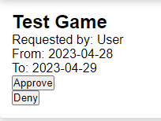
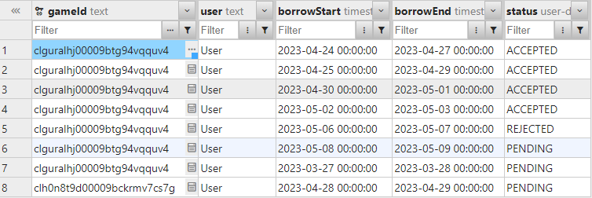

# What do I want to learn or understand better? Consider e.g. teamwork, Scrum, agile processes, technologies etc?  
I want to learn more how to create a code structure in TypeScript in order to reduce code duplication and makes it easier to maintain. I also want to work with others in a way that will more evenly balance out certain workloads and make it easier to work in parallel.

# What is my contribution towards the team’s deliveries? How can I help my team do better next sprint?  
My contribution towards the deliveries this week was to create both API endpoints and basic UIs for seeing and managing requests to borrow games, as well as seeing upcoming bookings for games in the future. Due to this being done in parallel with finalizing game ownerships and users, I was unfortunately not able to implement those features into my work.

# Changes/improvements from last week's reflection?  
I feel that I was able to work much more on my own this time, as for last week where I worked mostly in pair programming.
